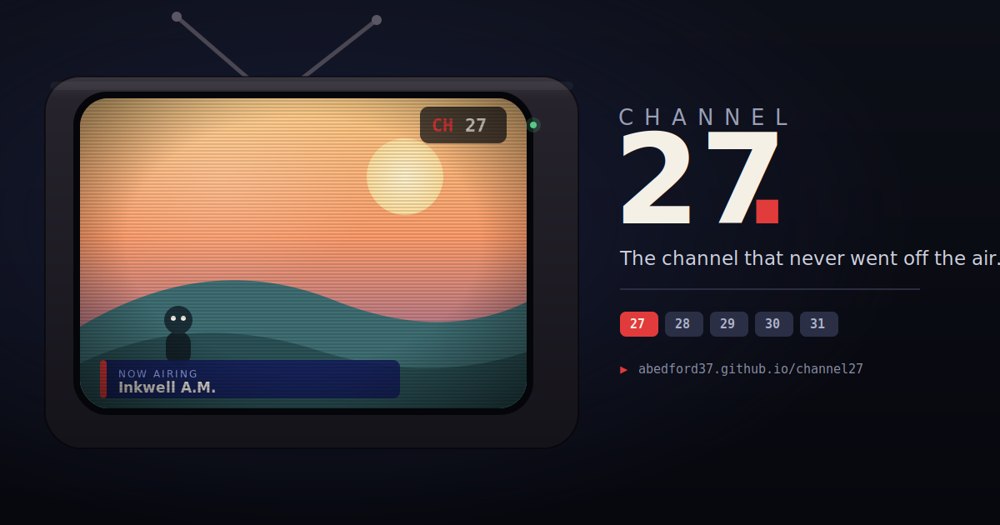

# 📺 Channel 27

**The channel that never went off the air.**

Channel 27 is an open-source television station from an alternate timeline, and now it comes with basic cable. There is no login, no profile, no recommendations, and no scroll. You open the site and the TV is already on. You join whatever is currently airing, and if you do not like it, you change the channel, exactly like cable television at the turn of the millennium.

Channel 27 itself is entirely original: the cartoons, the sitcoms, the game shows, the commercials for Indoor Mud and the Remote Remote. Nothing is copied from real shows or brands. Only the *feeling* is borrowed. The four newer channels on the dial are unofficial homages to the programming *rhythms* of late-1990s and early-2000s cable. See [Historical Programming and Embedded Media](#historical-programming-and-embedded-media).

## Watch it live

### [Open the live station](https://abedford37.github.io/channel27/)

The set is already warm when you arrive. Use the arrow keys or type a channel number to tune around. Channels 29 and 30 carry real, officially uploaded footage; the rest is original procedural animation.

<!-- Optional hero image: capture a screenshot or GIF of the running station,
     save it as docs/preview.png, and uncomment the two lines below.
[](https://abedford37.github.io/channel27/)
-->

## The dial

| # | Channel | Identity |
|---|---------|----------|
| 27 | **Channel 27** | The original alternate-timeline station. All original, all procedural, unchanged. |
| 28 | **Orange** | Youth programming. Preschool mornings, cartoon blocks, a messy Saturday game show, faux-interactive afternoons, spooky Fridays, comfort reruns overnight. |
| 29 | **Toon** | All animation. Public-domain theatrical classics in the morning, daytime comedy and action, an imported-animation slot in the evening, surreal shorts overnight. |
| 30 | **Music** | Music videos from 2000 to 2004. Morning rotation, an afternoon request countdown, evening genre blocks, weekend countdowns and acoustic sessions. |
| 31 | **Family** | Storybook mornings, educational afternoons, a nightly family movie, and a channel that tucks itself in. Currently all procedural. |

## Try it locally

```bash
# any static server works; no build step, no dependencies
cd channel27
python -m http.server 8000
# open http://localhost:8000
```

Opening `index.html` directly from `file://` also works for everything procedural. The YouTube embeds need a real `http(s)` origin (a local server or the Pages URL), and simply stay procedural without one.

### Controls

| Input | Action |
|---|---|
| **↑ / ↓** or **CH+ / CH-** | Channel up / down |
| **Number keys**, then **Enter** | Direct channel entry (dead numbers get you snow) |
| **G** / GUIDE | TV guide: ON NOW (all channels) and LISTINGS (current channel) |
| **M** / SOUND | Sound (always off until you turn it on) |
| **C** / CC | Closed captions |
| **F** / ⛶ | Fullscreen |

The guide footer has two accessibility preferences: **CRT effects** (scanlines and vignette off) and **Reduce flashing** (shorter, dimmer channel-change static). Both persist, as do your channel and caption choices. Your *position in a program* is never saved, because the broadcast does not wait for anyone.

## How it works

The broadcast is a **pure function of the clock, per channel**. There is no backend and no stored playback state. Two people watching the same channel at the same local time see the same show, the same scene, and the same commercials. The scheduler seeds a deterministic random generator with each program block's start time and channel, then slices the block into content segments and commercial breaks. Refreshing, channel-hopping, or waking a sleeping tab just recalculates position from the clock.

Every program *always* broadcasts as a procedural canvas cartoon: little characters with walk cycles, sitcom couches, game-show podiums, drawn in the show's palette, with episode scenes delivered as closed-caption-style lines. When a block has real footage (a contributed local file or a curated YouTube embed), that footage plays **on top of** the cartoon, seek-synced to broadcast time. If the footage fails, ends early, or never loads, the cartoon underneath simply becomes the signal again. At most you see a brief `SIGNAL UNAVAILABLE` card noting that the original Channel 27 presentation continues.

```
content/                everything a contributor usually touches
  channels.js           the dial: numbers, names, palettes, taglines
  shows.js              programs, episodes, scenes, palettes, mediaPools
  commercials.js        fake ads, PSAs, infomercials (channel-eligible)
  bumpers.js            station IDs, "be right back", "up next" (per-channel)
  media.js              curated YouTube records: IDs and attribution ONLY
  schedules/
    channel27.js ... 31.js   one weekly grid per channel: ["HH:MM", "show-id"]
js/
  scheduler.js          clock plus channel to block to segment (deterministic)
  ambient.js            per-genre procedural cartoons ("the signal")
  audio.js              synthesized static pops, stingers, CRT hum
  video.js              media controller plus local tape deck
  youtube.js            one YouTube player, broadcast-synced, failure-aware
  app.js                renderer, channel surfing, guide, prefs, a11y
css/style.css           the tube, the overlays, the Prevue-blue guide
tools/embed-test.html   quick check for whether a video actually embeds
index.html
```

Content files are validated on load. Duplicate channel numbers, unknown show or media IDs, days that do not start at `00:00`, bad time strings, unknown providers, and similar mistakes produce `console.warn` messages in the browser console.

## Historical Programming and Embedded Media

- **Channel 27's programming is fictional and original.** It is the heart of the project and never depends on third-party media.
- **Channels 28 through 31 are unofficial homages** to the programming *rhythms* of late-1990s and early-2000s cable networks (youth, animation, music, and family channels respectively). They are **not affiliated with, endorsed by, or connected to** the networks that inspired them, and they use none of those networks' names, logos, or branding. Schedule comments in `content/schedules/` note the historical grounding.
- **This project hosts no third-party television or music content.** The repository contains only metadata: YouTube video IDs, titles, and attribution. Embedded videos play from their original source through the official YouTube player. Copyright remains with the respective owners.
- **Availability can change.** If a video is removed, made private, or has embedding disabled, the channel does not break. The procedural broadcast continues, and the record can be set to `active: false` in `content/media.js`. (One upload has already been retired this way.)
- **Curation policy for contributors,** in order of preference: official network or studio uploads, then official artist and label uploads, then rights-holder channels, then public-domain material, then creator-approved uploads. Avoid anonymous full-episode reuploads. When nothing suitable exists, the correct move is a procedural program. That is not a fallback of last resort, it is the house style.

Embedding a video does not grant this project any license or ownership. It simply plays the video from where its uploader published it, subject to YouTube's embedding controls.

### Attribution

Full per-record detail (exact video IDs, uploader names, and verification notes) lives in `content/media.js`. In summary:

| Channel | Sourced footage | Source types |
|---|---|---|
| Orange 28 | Official network uploads: a classic game show and animated-series compilations | official |
| Toon 29 | Public-domain theatrical shorts (Fleischer, Betty Boop, Ub Iwerks ComiColor) and one official anime opening | public-domain, official |
| Music 30 | Official artist and label (VEVO) music videos from 2000 to 2004 | official, artist, label |

## Contributing

The whole point of the architecture is that **content is data**. To contribute you should almost never need to touch `js/`.

### Add a channel
Add a record to `content/channels.js` (unique `number` and `id`), create `content/schedules/channelNN.js` registering `window.C27.SCHEDULES["your-id"]`, add its script tag to `index.html`, and give it programs in `shows.js`. That is the whole checklist. Surfing, the guide, bumper eligibility, and validation pick it up automatically.

### Add a show
Add an object to `content/shows.js`:

```js
{
  id: "my-show",                 // unique, kebab-case
  title: "My Show",
  genre: "Cartoon",
  rating: "TV-Y7",               // TV-Y | TV-Y7 | TV-G | TV-PG | TV-14
  style: "toon",                 // see ambient styles below
  palette: ["#202040", "#404080", "#FFCC44"],  // [bgA, bgB, accent]
  tagline: "One sentence of attitude.",
  episodes: [
    { title: "Pilot", synopsis: "...", scenes: ["Line 1.", "Line 2."] }
  ]
}
```

Then schedule it in the channel's file under `content/schedules/`. Every day starts at `00:00`; a block runs until the next block begins.

**Ambient styles:** `toon`, `preschool`, `space`, `music`, `game`, `nature`, `cooking`, `news`, `sitcom`, `movie`, `latenight`, `infomercial`. Add new ones in `js/ambient.js`.

### Add local footage to an episode
Any episode (or commercial) can carry contributed video:

```js
media: { src: "media/my-show-pilot.mp4", loop: true }
// equivalently: media: { provider: "local", src: "...", loop: true }
```

The tape deck plays it over the procedural cartoon, seek-synced to broadcast time.

### Add a YouTube media record
Add to `content/media.js`:

```js
{
  id: "my-record",
  title: "Program Title",
  episodeTitle: "What this specific video is",
  type: "episode",              // episode | music-video | compilation | short | ...
  provider: "youtube",
  videoId: "VIDEO_ID",
  duration: 1320,               // seconds; lets non-loop videos end cleanly
  captions: false,              // does the upload have captions?
  sourceChannel: "Who uploaded it",
  sourceType: "official",       // official | rights-holder | artist | label |
                                // public-domain | creator-approved | unknown
  channels: ["music-30"],
  active: false,                // flip to true only after you confirm it embeds
  fallbackStyle: "music",       // ambient style if playback fails
  notes: "Where and when you verified it."
}
```

Reference it from a show's `mediaPool: ["my-record", ...]`, and the scheduler rotates through eligible pool entries deterministically, per block, per week. Or attach it directly to one episode with `media: { provider: "youtube", videoId: "...", duration: 1320 }`.

**Before you set `active: true`,** confirm the video actually embeds. Open `tools/embed-test.html` over `http(s)` (a local server or your Pages URL, never `file://`) and check that the tile plays. Only the videos that play should go active; the rest stay `active: false` and the procedural fallback covers them.

### Add a commercial or bumper
Same as ever, in `content/commercials.js` and `content/bumpers.js`. Both accept an optional `channels: ["orange-28"]` eligibility list (omit it and the item airs everywhere), and bumpers accept a `palette: [bg, glow, accent]` override. `{SHOW}` in a bumper line becomes the next program's title. Seasonal ads (`season: "halloween" | "christmas" | "summer"`) only air in the right month.

### Guidelines
- **Channel 27 stays original.** No copyrighted characters, shows, brands, lyrics, or logos in its content, not even renamed. Capture the era's energy, never its IP.
- **Channels 28 through 31 embed, never copy.** Real titles may appear as factual metadata for a linked authorized video; artwork, logos, and video files may not enter the repository.
- Keep it kind. Weird is great, mean is not. Late-night can be surreal, not offensive.
- Believability is the joke. The best content sounds like it genuinely could have aired.

## Deploying to GitHub Pages

1. Push the repository to GitHub.
2. Open **Settings** then **Pages**, and set the source to deploy from branch `main`, folder `/ (root)`.
3. Visit `https://<username>.github.io/<repo>/`.

That is it: static files only, no build step, no dependencies, no keys. The YouTube embeds work on Pages because it serves over `https`.

## Known limitations

- **Embeds are at the uploader's mercy.** Owners can disable embedding (error 101 or 150) or remove a video. When that happens the procedural fallback covers it, so nothing breaks.
- **Videos ship inactive.** Every sourced record starts as `active: false`. Verify it with `tools/embed-test.html` over `http(s)`, then set it active. A video only airs when its block is scheduled, the clock is inside that block, and its record is active.
- **YouTube needs a valid referrer.** Since late 2025 YouTube rejects embeds that arrive with no `Referer` header, showing "Error 153: video player configuration error." The page sets a referrer policy and uses the `youtube-nocookie.com` host to satisfy this. It only works when served over `http(s)`. Error 153 on every video means you are on `file://` (or a referrer-stripping context), not that the videos are blocked.
- **`file://` viewing is procedural-only.** The YouTube player needs an `http(s)` origin, so use a local server or your Pages URL to see real footage.
- **Sound stays off until you turn it on,** and some browsers also require one click before any media audio plays. Toggling captions re-cues the current video and re-syncs it to broadcast time.

## Roadmap ideas
- Channels 32 through 37 (Action, Retro, Public Access, Late Night, Game Shows, News and Weather); the registry already supports them.
- Themed weeks (Halloween, holiday specials) via seasonal schedules.
- An Emergency Broadcast System test, and a sign-off card for stations that *do* go off air.
- A community media-record review checklist.

## License

MIT. Broadcast responsibly.
